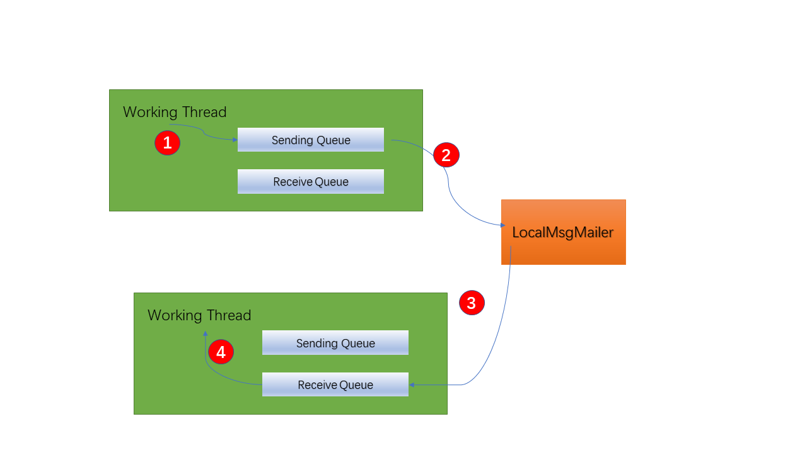

# 简介

不管是RPC还是IPC，本质都是通过某种**寻址方式**调用另一个**工作单元(线程)**的函数(subroutine)。

此处工作单元可以是主机(host)，进程(process)，线程(thread)。最终函数将在某个主机上的某个进程里的某个线程中执行。

为了简化情况，我们假设一台主机上只运行一个进程。


如果两个线程处于同一个进程(host)，那么调用线程(producer)会使用一个local thread id找到对应的线程，将数据投递给被调用线程(consumer)。此时数据由于不走网络，不需要序列化操作。


如果两个线程分别位于不同的进程(host)，那么调用线程(producer)会使用 global id(host id, local thread id)来找到对应进程上对应线程，将消息投递给被调用线程。此时数据会走网络，需要序列化操作。


# 线程服务注册中心

每个线程支持一个或多个服务，每个线程启动的时候，可以将自己的**地址`(ipEndPoint,localThreadID)`**和**服务**注册到全局的线程服务中心。线程服务注册中心本身也是一个线程，它的地址是写死在配置信息上的，比如

`(RegisterServerIPEndPoint = [127.0.0.1:23333], localThreadID=[1])`。

当然有些私有服务(socket, db)也是可以不注册的。


#### 全局服务管理 服务

GlobalEurekaService 负责全局的服务管理，只和NodeEurekaService通信，不和其他服务通信。

#### 节点服务管理 服务 

EurekaNodeService负责管理当前节点的服务，以及连接其他节点。


# 模块划分

RPCModule: invoker code  | handler code

AddressModule: local address  | global address

SerializerModule: none  | protobuf | msgpack(compress)


# 调用形式

```C#
RPC.SetDst(globalID).GetService<IXXXService>().HelloWorld("good morning")
    .TCallback=()=>{};
```


# 线程队列

为了避免阻塞，一个队列只能有一个生产者和一个消费者。队列的实现见[《网络发包的优化》](https://www.cnblogs.com/dewxin/p/16903335.html)。

为了简化设计，同时保证效率，我们令每个工作线程有个发送队列(sending queue)和接收队列(receiving queue)。工作线程往发送队列中投递消息，消息包含了目的线程的地址和函数信息。一个进程(host)会有一个`LocalMsgMailer`线程将各个线程发送队列中的消息取出，查看地址，并放到对应的目的线程的接收队列中。如果目的线程位于另一个进程，则会将消息投递到`SocketMessageWorker`的接收队列中。

